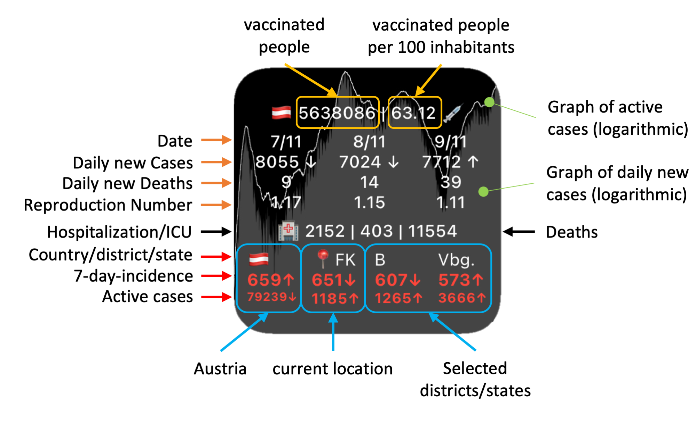

# Description
The COVID-19 widget shows the last three days of new cases and the associated R-value for Austria. The incidence for Austria, the district where your device is located and the districts specified by the user are displayed on the second line. The active cases in Austria are displayed in the third line. Furthermore, the active cases (narrow white line) and the daily new cases (gray filled area) are shown in the background.

# Setup
* Enable the location service for the scriptable app, if you want to use automatic displaying of the current incident you are located.
* If you like to specify your own disctricts, for example add following widget parameters: `204,KFL;312;706` for Klagenfurt Land (shown as KFL), Korneuburg and Landeck. The 3-digit GKZ can be found in the third row of https://covid19-dashboard.ages.at/data/CovidFaelle_Timeline_GKZ.csv.

# Data Sources
https://covid19-dashboard.ages.at
https://sites.google.com/view/corona-at/startseite
