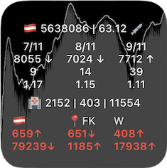
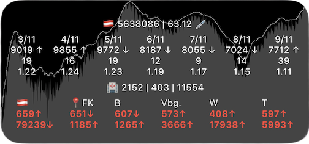

# Description
The COVID-19 widget shows in the first line the sum of the vaccinated people, in the second line the last three days of new cases, the daily deaths and the associated R-value for Austria. The hospitalization, ICU and the sum of deaths are shown below. The active cases in Austria are displayed on the second line from the bottom. The incidence for Austria, the district where your device is located and the districts specified by the user are displayed above. Furthermore, the active cases (narrow white line) and the daily new cases (gray filled area) are shown in the background. The widget supports offline caching (local and iCloud).


# Setup
* Enable the location service for the scriptable app, if you want to use automatic displaying of the current incident you are located.
* Change the global variable `const useLogarithmicScale = true` to `const useLogarithmicScale = false` if you like to few the graph without logarithmic scale.
* Per default following values are defined:
    ```
    const maxDaysDisplayed = {
      small: 3,
      medium: 7,
      large: 7,
    }
    ```
    Change them to your needs.
* If you like to specify your own disctricts or states, for example add following widget parameters: `804,FK;803,DO;8,Vbg.` for Dornbirn (shown as `DO`), Felkirch (shown as `FK`) and the state Vorarlberg shown as `Vbg.`. The 3-digit GKZ can be found in the third row of https://covid19-dashboard.ages.at/data/CovidFaelle_Timeline_GKZ.csv. The state ID can be found here: https://covid19-dashboard.ages.at/data/CovidFaelle_Timeline.csv.

# Data Sources
* https://covid19-dashboard.ages.at
* https://sites.google.com/view/corona-at/startseite
* https://www.sozialministerium.at/Informationen-zum-Coronavirus/Neuartiges-Coronavirus-(2019-nCov).html
* https://info.gesundheitsministerium.gv.at/data/timeline-eimpfpass.csv
